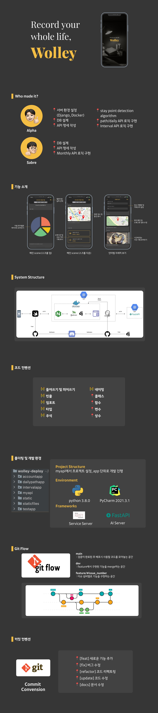

# Wolley

- **위치를 바탕으로 AI가 하루를 기록하고, 새로운 플레이스를 추천하는 서비스**
- **untinkable question : AI가 내 삶을 기록하고 개선 시켜 줄 수 있을까?**


## Environment


## Prerequisite

- Make a virtual environment

  ```shell
  $ cd server
  $ python3 -m venv myvenv
  ```

- Run a virtual environment

  ```shell
  (myvenv) ~/wolley-deploy$ source myvenv\Scripts\activate
  ```

- Install requirements

  - install requirements

    ```shell
    (myvenv) ~$ pip install -r requirements.txt
    ```

  - pip upgrade

    ```shell
    (myvenv) ~$ python3 -m pip install --upgrade pip
    ```

    

## Usage

```
(myvenv) ~/wolley-deploy$ python manage.py makemigrations
(myvenv) ~/wolley-deploy$ python manage.py migrate
```

```shell
(myvenv) ~/wolley-deploy$ python manage.py runserver
```


## Service imgs


