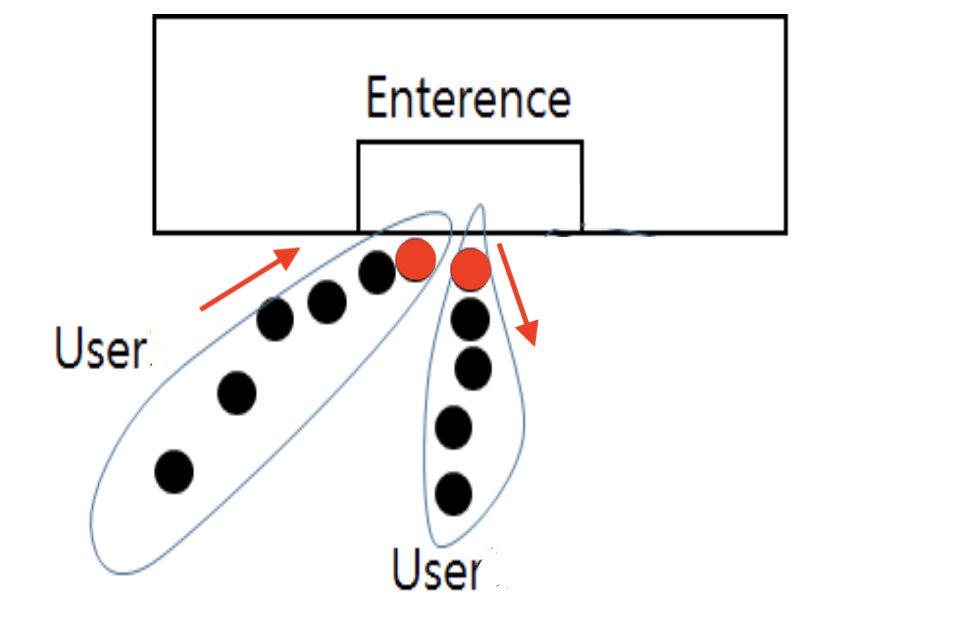
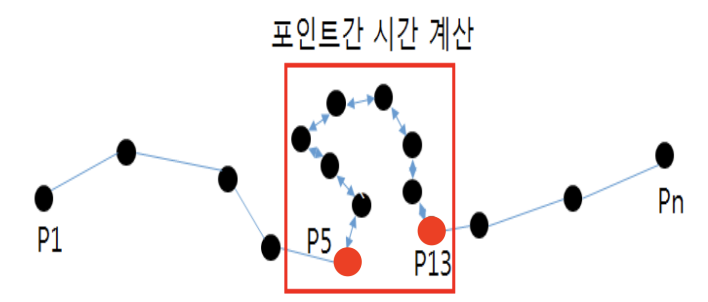

- **요약**
    - 지정한 Time Threshold 하에서 Distance Threshold 안에 찍혀있는 GPS 포인트들이 있다면, 이 포인트들의 위도와 경도의 평균이 Stay Point가 된다.
    - GPS 포인트들을 시간 순으로 순회하는데, 탐색하는 방식이 기본적으로 left pointer, right pointer를 이용하는 Two Pointer 알고리즘이다.
    - Two Pointer 알고리즘은 시간복잡도 O(n)이 된다.
    - (Stay Points 구간의 GPS 첫 번째 포인트의 시각) - (Stay Points 구간의 GPS 첫 번째 포인트의 시각)이 유저가 Stay Point에 서 머무른 시간이 된다.
    
- **Stay Point가 생기는 경우**
    - 유저가 시간 임계값을 초과하여 제한된 공간에 머무를 때
      
        
        
        - 예시) 점심 식사를 위해 식당에 들른 경우
        - 사람이 빌딩 안으로 들어가서 GPS 신호가 끊긴 다음 일정 시간이 지난 후 빌딩 밖으로 나오게 된다면, 이 시간 difference를 탐지하여 Stay Point가 생성된다.
    - 유저가 제한된 공간을 머무를 때
      
        
        
        - 예시) 공원에서 산책을 하게된 경우
        - 위 예시에서 P5와 P13의 시간 difference를 Stay Point 기간으로 설정하고, Stay Point spot은 P5, P6, ... , P13의 평균이다.
    
- **작성 코드**
  
    ```python
    def stayPointExtraction(points, distThres=200, timeThres=30 * 60):
        """
        extract stay points from a GPS log file
        input:
               points: point 객체들
               distThres: distance threshold
               timeThres: time span threshold
        default values of distThres and timeThres are 200 m and 30 min respectively, according to [1]
        """
        stayPointCenterList = []
        stayPointList = []
        pointNum = len(points)
        i = 0
        while i < pointNum - 1:
            # j: index of the last point within distTres
            j = i + 1
            flag = False
            while j < pointNum:
                if getDistanceOfPoints(points[i], points[j]) < distThres:
                    j += 1
                else:
                    break
    
            j -= 1
            # at least one point found within distThres
            if j > i:
                # candidate cluster found
                if getTimeIntervalOfPoints(points[i], points[j]) > timeThres:
                    nexti = i + 1
                    j += 1
                    while j < pointNum:
                        if getDistanceOfPoints(points[nexti], points[j]) < distThres and \
                                getTimeIntervalOfPoints(points[nexti], points[j]) > timeThres:
                            nexti += 1
                            j += 1
                        else:
                            break
                    j -= 1
                    latitude, longitude = computMeanCoord(points[i: j + 1])
                    arriveTime = points[i].dateTime
                    leaveTime = points[j].dateTime
                    dateTime = (arriveTime, leaveTime)
    
                    stayPointCenterList.append(Point(latitude, longitude, dateTime, arriveTime, leaveTime))
                    stayPointList.extend(points[i: j + 1])
            i = j + 1
        return stayPointCenterList, stayPointList
    ```