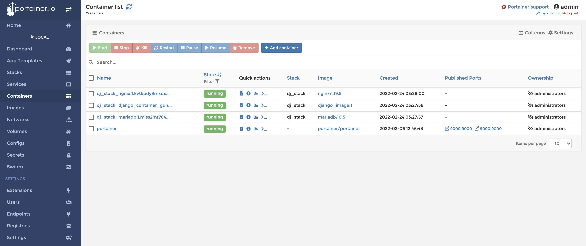
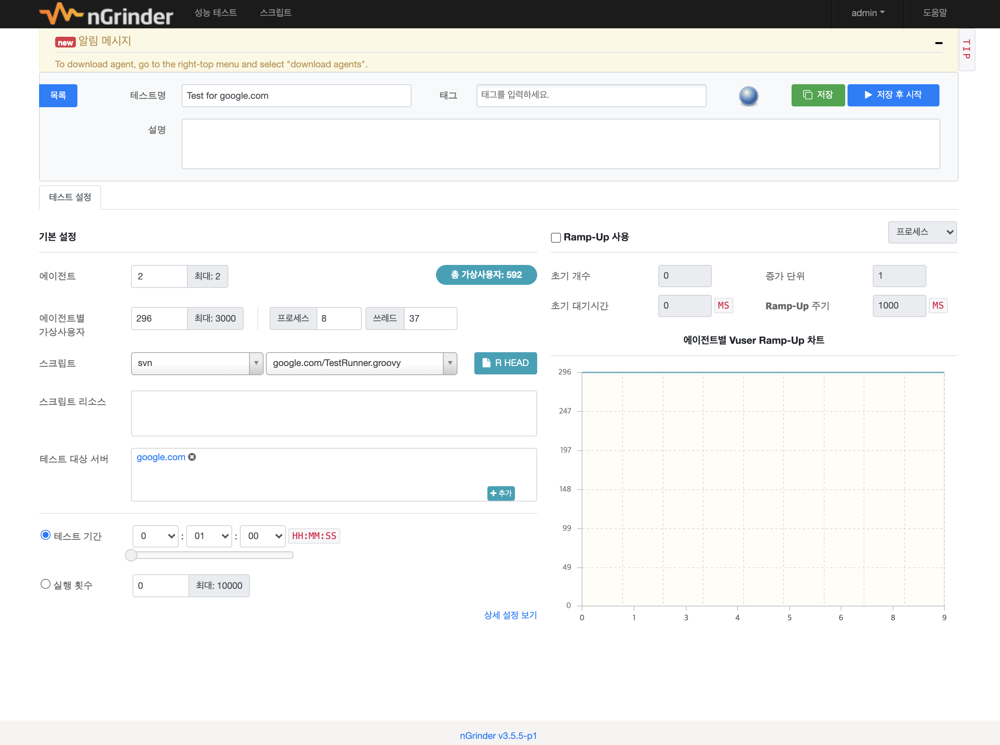

- **인스턴스**
    - 운영하는 인스턴스는 총 4개
        - 인스턴스1 (https 인증)
            - 배포된 앱에서 동작하는 **`실 서비스 API 서버`**
        - 인스턴스2 (https 인증)
            - 프론트 단과의 통신을 테스트하는 **`FE-BE 테스트 API 서버`**
        - 인스턴스3
            - 백엔드 단의 로직을 테스트하는 **`BE 전용 API 서버`**
            - 잦은 배포와 수정으로 인해, 인스턴스2에 영향을 줄이고자 생성
            - jenkins 자동 배포 환경 구축
        - 인스턴스4
            - 서비스 서버의 **`부하테스트(nGrinder 이용)를 위한 서버`**
            - 가상의 User를 생성하며 컴퓨팅 자원을 크게 소모하여, 다른 인스턴스들과 분리
- **GCP setting**
    - 운영체제: `ubuntu`
    - 방화벽: HTTP 트래픽
    - 고정 IP
    - Port Opend
        - 22, 80, 443, 8000, 8888, 9000
    - https 인증
- **도커 (version 3.7)**
    - **Docker Stack**
        - 도입 목적
            - auto healing
                - service는 갑자기 알수없는 오류로 인해서 컨테이너 하나를 못쓰게 되면 즉시 새로운 컨테이너를 만들어서 구동시키게 된다.
            - easily scale out/in/up/down
                - 간단히 docker 서비스들을 추가 생성할 수 있다.
            - blue / green deploy 염두
                - 서비스의 중단없이 로직을 업데이트 할 수 있다.
    - **Docker Containers**
        - `django-gunicorn` 컨테이너 (custom image)
        - `nginx` 1.19.5 컨테이너
        - `mariadb` 10.5 컨테이너
- **Portainer (port 9000)**
    - 도커 이미지, 컨테이너 명령을 GUI 환경에서 편하게 제어
    - 에러 로그들을 실시간으로 손쉽게 확인.
    
    
    
- **Jenkins (port 8080)**
    - 배포시 지난하게 반복되는 작업이 있었고, 이를 자동화하는 목적
    - Trigger
        - `git push`
    - Side Effect
        - Discord 채널에 알림
    - 자동화하는 작업 순서
        - Docker Stack 삭제
        - django, nginx, mariadb 이미지 삭제
        - Dockerfile을 이용하여 새로운 django 이미지 생성
        - docker-compose.yml 파일 이용 Docker Stack 생성
- **nGrinder (port 8888)**
    - 의도적으로 시스템에 부하를 발생시킴
    - 상위 5%의 화면이 95% 사용자의 요청을 받는다고 가정을 따르고 있음
    - Test하는 것들 : Time, TPS, Users
    
    
    
- **Firebase**
    - BE에서 작동하는 timer를 트리거로 프론트 단의 앱을 깨우기 위함
        - 앱을 깨워 GPS 로그를 디바이스에 저장할 수 있다.
        - 앱을 깨워 백엔드 단에 GPS 로그 정보들을 넘겨줄 수 있다.